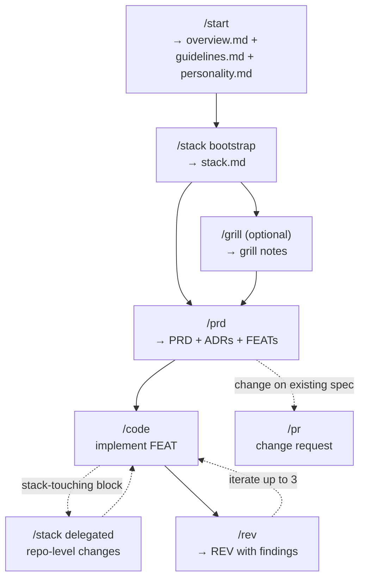

# ccosming skills

Personal Claude Code skills by Carlos Cosming.

Plugin namespace: `ccosming` → invoke as `/ccosming:<skill-name>`.

## Installation

_TODO — marketplace install instructions._

## How to use

The plugin's skills work together as a system. Below is the natural order for a
typical project.

### Bootstrap

A new project starts with `/start`, which first writes `.spec/config.yaml`
(language preferences), then generates the three orthogonal context files via a
3-phase grilling (north star → engineering identity → agent persona):

- `.spec/config.yaml` — language preferences (`language.chat`,
  `language.artifacts`)
- `.spec/overview.md` — project north star (mission, users, capabilities,
  outcomes, scope, constraints, context)
- `.spec/guidelines.md` — transversal engineering practices (stack-agnostic)
- `.spec/personality.md` — agent persona that `/code` embodies

Without these, every other skill aborts in pre-flight.

### Workflow

### Skill index

**Foundation**

- `/start` — bootstrap `config.yaml` (language preferences) and the three
  orthogonal context files (north star, guidelines, persona)
- `/stack` — repository stack, monorepo, devtools, folder structure (writes
  `stack.md`)

**Definition**

- `/grill` — articulate fuzzy ideas before committing to a PRD
- `/domain` — optional: ubiquitous language (terms, bounded contexts, context
  map). Invoked by `/prd` in delegated mode when a new term is detected during
  grilling.
- `/prd` — define a new capability (PRD + ADRs + FEATs)
- `/pr` — change request on an existing PRD

**Implementation**

- `/code` — implement a FEAT (delegates stack-touching blocks to `/stack`)
- `/rev` — code review with iteration loop

**Helpers** (invoked inside other skills via Task subagent, not user-invocable)

- `/research` — single-perspective domain research
- `/clarify` — polysemic-term disambiguation
- `/summarize` — multi-source consolidation
- `/audit` — system integrity check, validates `.spec/` artifacts against
  invariants; runs at closure of every skill that writes to `.spec/`

**Authoring & quality**

- `/commit` — Conventional Commits with secrets check
- `/create-skill` — interactive guide to add a new skill
- `/prompt-craft` — compression discipline for LLM-targeted markdown
- `/humanizer` — strip AI-writing tells
- `/coding-rules` — behavioral guidelines for code work

## Available skills

_See the [Skill index](#skill-index) above._

## Artifacts

The skills in this plugin operate over a shared set of artifacts that live in
the **target project**, not in this repository. Each system artifact follows the
convention `.spec/{type}s/{TYPE}-NNN-{slug}.md` with an `id: {TYPE}-NNN` field
in frontmatter and SemVer versioning.

| Artifact        | Path                               | Description                                                                                                                             | Skills that use it                                                                             |
| --------------- | ---------------------------------- | --------------------------------------------------------------------------------------------------------------------------------------- | ---------------------------------------------------------------------------------------------- |
| **Config**      | `.spec/config.yaml`                | Language preferences: `language.chat` and `language.artifacts`. Drives how every skill speaks to the user and writes content.           | `start` (creates), all other skills (read in pre-flight)                                       |
| **Overview**    | `.spec/overview.md`                | Project north star: mission, users, capabilities (output + quality bars), outcomes (with traceability), scope, constraints, context.    | `start` (creates), `stack`/`prd`/`code`/`rev`/`pr` (read)                                      |
| **Guidelines**  | `.spec/guidelines.md`              | Transversal engineering practices (principles, anti-patterns, quality bar). Stack-agnostic.                                             | `start` (creates), `stack`/`prd`/`code`/`rev`/`pr` (read)                                      |
| **Personality** | `.spec/personality.md`             | Agent persona `/code` embodies (seniority, decision bias, communication, priority).                                                     | `start` (creates), `stack`/`prd`/`code`/`rev`/`pr` (read)                                      |
| **Stack**       | `.spec/stack.md`                   | Living source of truth for languages, monorepo, folder structure, devtools, configs. Tracks `sync_status` against the actual repo.      | `stack` (writes), `code`/`prd`/`rev`/`pr` (read)                                               |
| **Domain**      | `.spec/domain.md`                  | **Optional**. Ubiquitous language (DDD): definition, terms table, bounded contexts, context map. Skills degrade gracefully when absent. | `domain` (writes), `prd`/`code`/`rev`/`pr`/`stack` (read if exists)                            |
| **PRD**         | `.spec/prds/PRD-NNN-{slug}.md`     | New capability definition (problem, users, metrics, scope).                                                                             | `prd` (creates), `code`/`rev`/`pr` (read)                                                      |
| **ADR**         | `.spec/adrs/ADR-NNN-{slug}.md`     | Technical decision with real trade-off (reduced Nygard format).                                                                         | `prd` (creates), `code`/`rev`/`pr` (read)                                                      |
| **FEAT**        | `.spec/feats/FEAT-NNN-{slug}.md`   | Implementable unit (scope, rules, criteria, plan, dependencies).                                                                        | `prd` (creates), `code` (writes plan/status), `rev` (reads + metadata), `pr` (reads + cascade) |
| **REV**         | `.spec/reviews/REV-NNN-{slug}.md`  | Code review with classified findings (blocker/major/minor/nit) and iterations.                                                          | `rev` (writes), `code` (reads in review mode)                                                  |
| **PR**          | `.spec/prs/PR-NNN-{slug}.md`       | Immutable change request (`locked`) with cascade analysis.                                                                              | `pr` (writes)                                                                                  |
| **GRILL**       | `.spec/grills/GRILL-NNN-{slug}.md` | Structured interview notes (discovery/technical/full) with integrated verdict.                                                          | `grill` (writes)                                                                               |

**Categories**:

- **Config** (1): `config.yaml` — language preferences (chat, artifacts). Drives
  localization in every skill. Mandatory.
- **Orthogonal context** (3): `overview.md`, `guidelines.md`, `personality.md` —
  read-only, define the project's "how". Without these, skills stop in
  pre-flight.
- **Foundation** (1): `stack.md` — single living source of truth for languages,
  monorepo, devtools, configs. Mutated only by `/stack`; carries a `sync_status`
  field against the actual repo.
- **Domain** (1, optional): `domain.md` — ubiquitous language (DDD). Defines
  terms, bounded contexts, and their relationships. Mutated by `/domain`. Other
  skills read it when present and operate without it when absent.
- **System artifacts** (6 types): PRD, ADR, FEAT, REV, PR, GRILL — versioned
  with SemVer and status, flow between skills following the cycle
  `/stack → /prd → /code → /rev → /pr` (with `/grill` and `/pr` as side
  entries).

## Conventions

Plugin-wide rules every skill enforces and `/audit` validates. They are the
contract of the system — projects inherit them by default; document deviations
in `overview.md` only when customizing.

### Status flow

- `draft` → `ready`: artifact complete and ready for the next consumer.
- `ready` → `in-progress`: skill picked it up (FEAT during `/code`, REV during
  iteration loop).
- `in-progress` → `done`: terminal success.
- `in-progress` → `locked`: terminal immutable (PR only).
- any state → `deprecated`: superseded by a newer artifact, kept for history.

### Versioning (SemVer)

Every artifact carries `version: X.Y.Z` in frontmatter. Bump rules:

- **MAJOR**: contract break — criterion removed/redefined, ADR replaced, scope
  inverted.
- **MINOR**: compatible addition — new section, new criterion, new linked
  artifact.
- **PATCH**: clarification, wording, metadata refresh.
- **Promotion to `1.0.0`**: first transition to terminal state
  (`done`/`locked`). Handled by the owning skill.

Born at `0.1.0`. Never decreases, even if status drops.

### Localization

Every skill (except read-only helpers like `/audit`, `/clarify`, `/research`,
`/summarize`) reads `.spec/config.yaml` in pre-flight and applies:

- **`language.chat`** — language for user-facing prose: `AskUserQuestion` text,
  summaries, confirmations.
- **`language.artifacts`** — language for user-generated content written into
  artifacts (descriptions, changelog row bodies).
- **Structure stays English regardless**: frontmatter keys, `## Section`
  headers, table column headers, status values (`draft`/`ready`/...).
- **Always neutral register**: no regional idioms. Spanish uses `tú` or
  impersonal forms, never voseo (`vos`/`querés`/`podés`/`sos`). English stays
  standard, no slang.

Supported languages: `en`, `es`. `/start` recommends the user's system language
(detected via macOS `defaults read -g AppleLanguages` with `$LANG` fallback) as
default for both fields.

### Frontmatter shape

All artifacts share a common frontmatter shell. Required fields per type:

| Type                                                     | Required fields                                                                   |
| -------------------------------------------------------- | --------------------------------------------------------------------------------- |
| Orthogonal context (overview / guidelines / personality) | `id`, `status`, `version`, `prs`                                                  |
| Stack                                                    | `id`, `status`, `version`, `sync_status`, `last_verified`, `adrs`, `prs`          |
| PRD                                                      | `id`, `title`, `status`, `version`, `prs`, `adrs`, `feats`                        |
| ADR                                                      | `id`, `title`, `status`, `version`, `prds`, `feats`, `prs`                        |
| FEAT                                                     | `id`, `title`, `status`, `version`, `prd`, `adrs`, `depends_on`, `reviews`, `prs` |
| REV                                                      | `id`, `title`, `status`, `version`, `target`, `iterations`, `verdict`             |
| PR                                                       | `id`, `title`, `status`, `version`, `target`, `affects`                           |
| GRILL                                                    | `id`, `doc`, `status`, `profile`, `topic`, `lenses`, `open_questions`             |

Every artifact (except GRILL during the loop) has a `## Changelog` section at
the bottom — every version bump produces a row with timestamp, version, and the
**why**.

## Project structure

_TODO — see [CLAUDE.md](CLAUDE.md) for the maintainer guide._

## Contributing

_TODO._

## License

MIT
