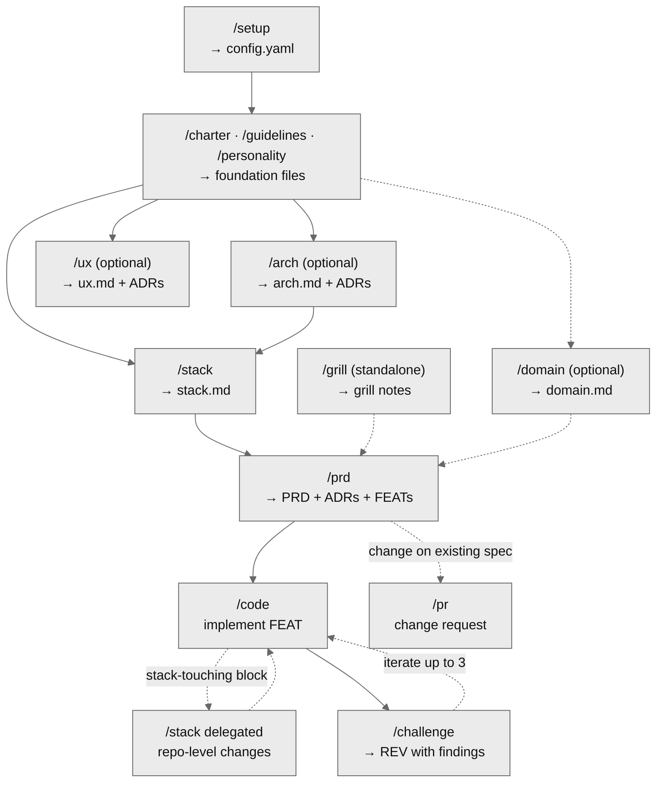

# ccosming skills

Personal Claude Code skills by Carlos Cosming — a spec-driven development system
that bootstraps, designs, builds, and reviews software from a versioned `.spec/`
source of truth.

Plugin namespace: `ccosming` → invoke as `/ccosming:<skill-name>`.

## Installation

The plugin is published as a Claude Code marketplace plugin from this repo:

```text
/plugin marketplace add ccosming/skills
/plugin install ccosming@ccosming
```

Once installed, a session-start hook injects the plugin constitution (and, in a
bootstrapped project, the live foundation) so the skills are ready to use.

## How it works

The system has a single source of truth, the `.spec/` directory in the **target
project** (not in this repo). Every artifact lives there; skills read and write
it under a shared set of rules (the _constitution_).

Two entry points (_doors_) drive the work:

- **`/spec`** — the only door that creates or evolves `.spec/` artifacts. It
  bootstraps a new project and routes each request (charter, guidelines, stack,
  domain, arch, ux, PRD, change request…) to the skill that owns it.
- **`/code`** — implements a `ready` FEAT, running its build⇄review loop
  internally.

Every other skill is a **delegate**, invoked by a door or by another skill; it
does its job, reports in its own voice, and returns. Sequencing belongs to the
door — delegates never tell you to run the next command. (A third door, `/issue`
for symptom triage, is defined in the constitution but not yet implemented.)

Most artifact skills share a **grilling engine**: a dimension-coverage loop
driven by a per-skill `references/rubric.md`. It scales depth by materiality
(challenging contested, irreversible, or high-blast-radius decisions; confirming
trivial ones), records stance-changing user interventions in an
`## Interaction notes` section, and ends with a mandatory `Accept` / `Adjust`
gate — nothing advances until you accept the artifact.

### Workflow



### Skill index

**Doors**

- `/spec` — single door to `.spec/`; bootstraps and routes to the owning skill
- `/code` — implement a FEAT (delegates stack-touching blocks to `/stack`,
  invokes `/challenge` after implementation)

**Foundation** (bootstrap, in order)

- `/setup` — write `config.yaml` (language preferences); first bootstrap step
- `/charter` — project source of truth → `charter.md`
- `/guidelines` — transversal engineering conventions → `guidelines.md`
- `/personality` — agent persona `/code` embodies → `personality.md`

**Design & structure** (optional artifacts, except stack)

- `/stack` — repository stack, monorepo, devtools, folder structure → `stack.md`
- `/arch` — technical architecture across C4 levels (monochrome Mermaid
  flowcharts) + ADRs → `arch.md`
- `/ux` — surface-agnostic experience (interaction loops + testable qualities) +
  ADRs → `ux.md`
- `/domain` — ubiquitous language (terms, bounded contexts, context map) →
  `domain.md`. Also runs in delegated mode (inline) when `/prd` detects a term.

**Capability & change**

- `/prd` — define a new capability → PRD + derived ADRs + FEATs
- `/pr` — change request over an existing PRD (cascade analysis, locked on
  close)
- `/challenge` — review an implemented FEAT → REV with classified findings; runs
  up to 3 remediation cycles with `/code`

**Helpers** (read-only or single-shot; `context: fork` — invoked directly with
`Skill(...)`, run isolated, return their result; not user-invocable)

- `/audit` — validate `.spec/` artifacts against the invariants (structural);
  runs at the closure of every skill that writes to `.spec/`
- `/consistency` — semantic critic; reads an assembled artifact cold and reports
  cross-section contradictions before the confirmation gate (complements
  `/audit`)
- `/clarify` — disambiguate the single most load-bearing polysemic term
- `/research` — single-perspective domain research
- `/summarize` — multi-source consolidation

**Standalone**

- `/grill` — interview to articulate a fuzzy idea before a PRD →
  `.spec/grills/`. User-invoked only; nothing else calls it. Reuses `/clarify`,
  `/research`, `/summarize`.

**Authoring & quality** (general utilities, not part of the spec flow)

- `/commit` — Conventional Commits with a secrets check and explicit approval
- `/merge` — Git merge with strategy selection and approval
- `/create-skill` — interactive guide to add a new skill to this repo
- `/prompt-craft` — compression discipline for LLM-targeted markdown
- `/humanizer` — strip AI-writing tells from prose
- `/coding-rules` — behavioral guidelines for code work

## Hooks

The hooks in `hooks/hooks.json` are all Python under `hooks/`:

| Script           | Events                                     | What it does                                                                                                                                                                                          |
| ---------------- | ------------------------------------------ | ----------------------------------------------------------------------------------------------------------------------------------------------------------------------------------------------------- |
| `inject.py`      | `SessionStart`                             | Emits the constitution plus, in a bootstrapped project, the live foundation into context — once per session, so skills do not re-read these files each run.                                           |
| `format_spec.py` | `PostToolUse` (`Write`/`Edit`/`MultiEdit`) | Normalizes any `.spec/*.md` just written — aligns GFM tables, wraps prose (keeping links and code spans atomic), normalizes blank lines — and leaves fenced code and YAML frontmatter verbatim.       |
| `metrics.py`     | `Stop`, `UserPromptSubmit`, `PostToolUse`, `SessionStart` | Updates the project's live cost-and-time ledger (`.spec/usage.md`). Four triggers so a missed `Stop` — e.g. a turn ending on a pending question — never strands the ledger: `PostToolUse` keeps it live mid-grilling and bootstraps it in a from-scratch session, the next prompt or session start backstops the rest. |

`.spec/usage.md` is a per-project, accumulating ledger: cost per `.spec/`
artifact (the five token categories + cache hit, plus tool calls, user prompts,
assistant turns), a time ledger per artifact (effective work vs. human wait vs.
real wall-clock), a per-skill breakdown, and a per-session log. It is parsed
incrementally; `Updated through` reports the last turn folded in, so a stale
ledger shows itself. Written only when the project already has a `.spec/`
directory. Like `config.yaml`, it is a generated non-artifact — `/audit` and the
formatter skip it.

## Artifacts

The skills operate over artifacts that live in the **target project**. Numbered
artifacts follow `.spec/{type}s/{TYPE}-NNN-{slug}.md` with `id: {TYPE}-NNN` in
frontmatter; singletons live at `.spec/{name}.md`. The body `# H1` is the human
title — the code lives in `id` and the filename, never a `title:` field.

| Artifact         | Path                               | Description                                                                                                                                                   | Skills that use it                                                |
| ---------------- | ---------------------------------- | ------------------------------------------------------------------------------------------------------------------------------------------------------------- | ----------------------------------------------------------------- |
| **Config**       | `.spec/config.yaml`                | Language preferences (`language.chat`, `language.artifacts`). Generated non-artifact — drives localization everywhere.                                        | `setup` (creates), all skills (read via injected foundation)      |
| **Usage ledger** | `.spec/usage.md`                   | Generated, accumulating cost-and-time ledger per artifact/skill/session. Written by the metrics hook (`Stop`/`UserPromptSubmit`/`PostToolUse`/`SessionStart`), not a skill. | `metrics.py` hook (writes)                                        |
| **Charter**      | `.spec/charter.md`                 | Project source of truth: problem, solution, domain, users, functional & non-functional requirements, success metrics, scope, constraints.                               | `charter` (creates), all downstream skills (read)                 |
| **Guidelines**   | `.spec/guidelines.md`              | Transversal engineering practices. Stack-agnostic.                                                                                                            | `guidelines` (creates), all downstream skills (read)              |
| **Personality**  | `.spec/personality.md`             | Agent persona `/code` embodies (seniority, decision bias, communication, priority).                                                                           | `personality` (creates), `code` (read)                            |
| **Stack**        | `.spec/stack.md`                   | Living source of truth for languages, monorepo, devtools, configs. Tracks `sync_status` against the actual repo.                                              | `stack` (writes), `code`/`prd`/`challenge`/`pr` (read)            |
| **Domain**       | `.spec/domain.md`                  | **Optional**. Ubiquitous language (DDD): terms, bounded contexts, context map. Skills degrade gracefully when absent.                                         | `domain` (writes), `prd`/`code`/`stack` (read if exists)          |
| **Architecture** | `.spec/arch.md`                    | **Optional**. Technical architecture across C4 levels (monochrome flowcharts), boundaries, data, integrations, NFRs. Generates ADRs.                          | `arch` (writes), `stack`/`code`/`pr` (read if exists)             |
| **Experience**   | `.spec/ux.md`                      | **Optional**. Surface-agnostic experience: interaction loops + testable quality triples. Generates ADRs.                                                      | `ux` (writes), `prd`/`code`/`pr` (read if exists)                 |
| **PRD**          | `.spec/prds/PRD-NNN-{slug}.md`     | New capability definition (problem, users, metrics, scope, criteria).                                                                                         | `prd` (creates), `code`/`challenge`/`pr` (read)                   |
| **ADR**          | `.spec/adrs/ADR-NNN-{slug}.md`     | Technical decision with a real trade-off (reduced Nygard format).                                                                                             | `prd`/`arch`/`stack` (create), `code`/`pr` (read)                 |
| **FEAT**         | `.spec/feats/FEAT-NNN-{slug}.md`   | Implementable unit (scope, rules, criteria, plan, dependencies).                                                                                              | `prd` (creates), `code` (writes plan/status), `challenge` (reads) |
| **REV**          | `.spec/reviews/REV-NNN-{slug}.md`  | Code review with classified findings (blocker/major/minor/nit) and iterations.                                                                                | `challenge` (writes), `code` (reads in review mode)               |
| **PR**           | `.spec/prs/PR-NNN-{slug}.md`       | Immutable change request (`locked`) with cascade analysis.                                                                                                    | `pr` (writes)                                                     |
| **GRILL**        | `.spec/grills/GRILL-NNN-{slug}.md` | Standalone interview notes (discovery/technical/full).                                                                                                        | `grill` (writes)                                                  |

## Conventions

Plugin-wide rules every skill enforces and `/audit` validates. They are the
constitution — projects inherit them by default.

### Status flow

- `draft` → `ready`: artifact complete and ready for the next consumer.
- `ready` → `in-progress`: a skill picked it up (FEAT during `/code`).
- `in-progress` → `done`: terminal success.
- `in-progress` → `locked`: terminal immutable (PR only).
- any state → `deprecated`: superseded by a newer artifact, kept for history.

### Versioning (SemVer)

Every artifact carries `version: X.Y.Z`. Born at `0.1.0`; never decreases.

- **MAJOR**: contract break — criterion removed/redefined, ADR replaced, scope
  inverted.
- **MINOR**: compatible addition — new section, criterion, or linked artifact.
- **PATCH**: clarification, wording, metadata refresh.
- **Promotion to `1.0.0`**: first transition to a terminal state
  (`done`/`locked`).

### Confirmation gate

No artifact is final until you accept it. After writing one, the skill
summarizes what was captured and asks `Accept` / `Adjust`. Nothing advances — no
next stage, no chaining — until you accept. On `Adjust`, the skill revises the
named part and re-confirms.

### Localization

Skills read `.spec/config.yaml` and apply:

- **`language.chat`** — all user-facing prose (questions, summaries,
  confirmations).
- **`language.artifacts`** — user-generated content written into artifacts.
- **Structure stays English** — frontmatter keys, `## Section` headers, table
  headers, status/enum values. Never translated.
- **Neutral register always** — no regional idioms; Spanish uses
  `tú`/impersonal, never voseo.

Supported languages: `en`, `es`. `/setup` recommends the detected system
language.

### Markdown & diagrams

- One `# H1` per artifact: the human title, **without** the artifact code.
- Diagrams use the minimalist Mermaid style from `references/diagrams.md` —
  `flowchart`/`graph` with `theme: neutral`, no custom colors. Architecture
  views render the C4 levels as stereotype-labeled flowcharts.
- Line wrapping, table alignment, and blank-line spacing are the formatter's job
  (the `PostToolUse` hook) — write valid Markdown and let it normalize.

### Frontmatter shape

No `title:` field — the human title is the body `# H1`. Required fields per
type:

| Type                                             | Required fields                                                          |
| ------------------------------------------------ | ------------------------------------------------------------------------ |
| Foundation (charter / guidelines / personality)  | `id`, `status`, `version`, `prs`                                         |
| Domain                                           | `id`, `status`, `version`, `prs`                                         |
| Architecture                                     | `id`, `status`, `version`, `prs`, `adrs`                                 |
| Experience                                       | `id`, `status`, `version`, `prs`, `adrs`, `surfaces`                     |
| Stack                                            | `doc`, `status`, `sync_status`, `version`, `last_verified`, `adrs`       |
| PRD                                              | `id`, `status`, `version`, `prs`, `adrs`, `feats`                        |
| ADR                                              | `id`, `status`, `version`, `prs`, `prds`, `feats`                        |
| FEAT                                             | `id`, `status`, `version`, `prs`, `reviews`, `prd`, `adrs`, `depends_on` |
| REV                                              | `id`, `status`, `version`, `target`, `iterations`, `verdict`             |
| PR                                               | `id`, `status`, `version`, `target`, `affects`                           |
| GRILL                                            | `id`, `doc`, `status`, `profile`, `topic`, `lenses`, `open_questions`    |

Every artifact ends with a `## Changelog` section (one row per version bump,
stating the **why**); an `## Interaction notes` section sits just above it when
a user intervention shaped the artifact.

## Project structure

```text
.claude-plugin/      Plugin + marketplace manifests
hooks/               Session/format/metrics hooks (Python) + hooks.json
references/          constitution.md · grilling-engine.md · diagrams.md
skills/<name>/       One folder per skill: SKILL.md (+ references/, scripts/)
```

See [CLAUDE.md](CLAUDE.md) for the maintainer guide (skill authoring
conventions, frontmatter reference, the description-field formula,
anti-patterns).

## Contributing

Use `/create-skill` to scaffold a new skill, then follow the checklists in
[CLAUDE.md](CLAUDE.md). Commits go through `/commit` (Conventional Commits,
secrets check, explicit approval).

## License

MIT
