# Diagram catalog

A methodological catalog of the diagrams used across the plugin, all rendered in
Mermaid. Orthogonal knowledge — load it on demand when a skill needs to draw.
Which skill draws which diagram is each skill's decision; this file defines only
purpose, fit, and syntax.

Agile principle: draw only the diagram that answers a concrete question. Prefer
one clear view over exhaustive documentation.

## Selection

| Question to answer                                 | Diagram       | Mermaid type      |
| -------------------------------------------------- | ------------- | ----------------- |
| How does the system sit among users and externals? | C4 Context    | `C4Context`       |
| What are the major technical building blocks?      | C4 Container  | `C4Container`     |
| What is inside one container?                      | C4 Component  | `C4Component`     |
| How do containers collaborate at runtime?          | C4 Dynamic    | `C4Dynamic`       |
| What entities exist and how do they relate?        | UML Class     | `classDiagram`    |
| What can each actor do with the system?            | UML Use case  | `flowchart`       |
| How do parts exchange messages over time?          | UML Sequence  | `sequenceDiagram` |
| What is the control flow of a process?             | UML Activity  | `flowchart`       |
| What states does an entity move through?           | UML State     | `stateDiagram-v2` |
| How is the system split into software components?  | UML Component | `flowchart`       |
| What does the user feel across a journey?          | User Journey  | `journey`         |

## C4 family

System architecture across abstraction levels. Each level answers a distinct
question for a distinct audience. Mermaid's C4 support is experimental but
expressive enough for these views.

### C4 Context — the widest view: system + users + external systems

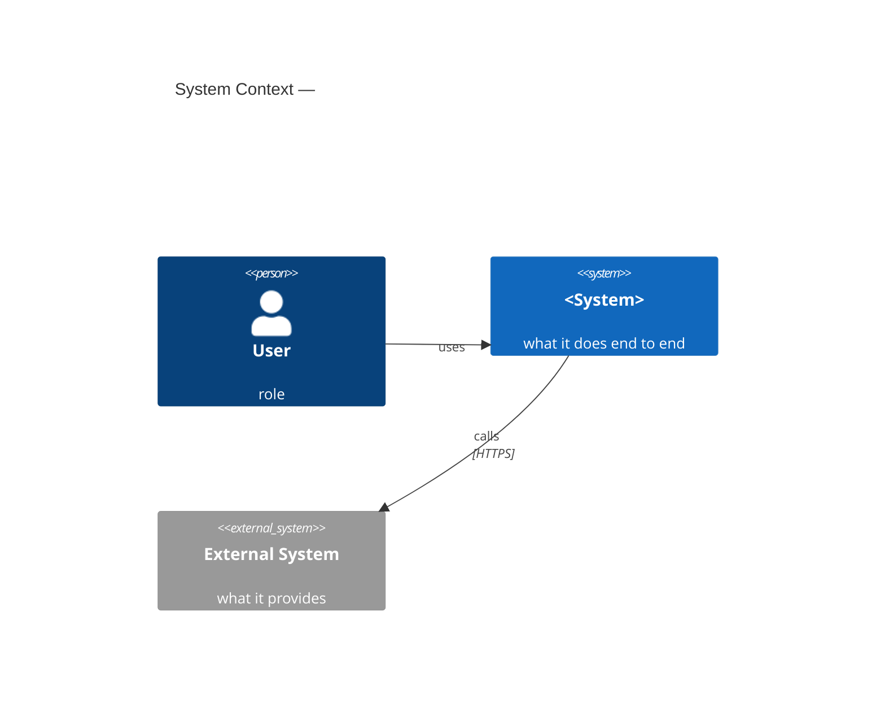

### C4 Container — the major technical blocks (apps, APIs, stores, workers)

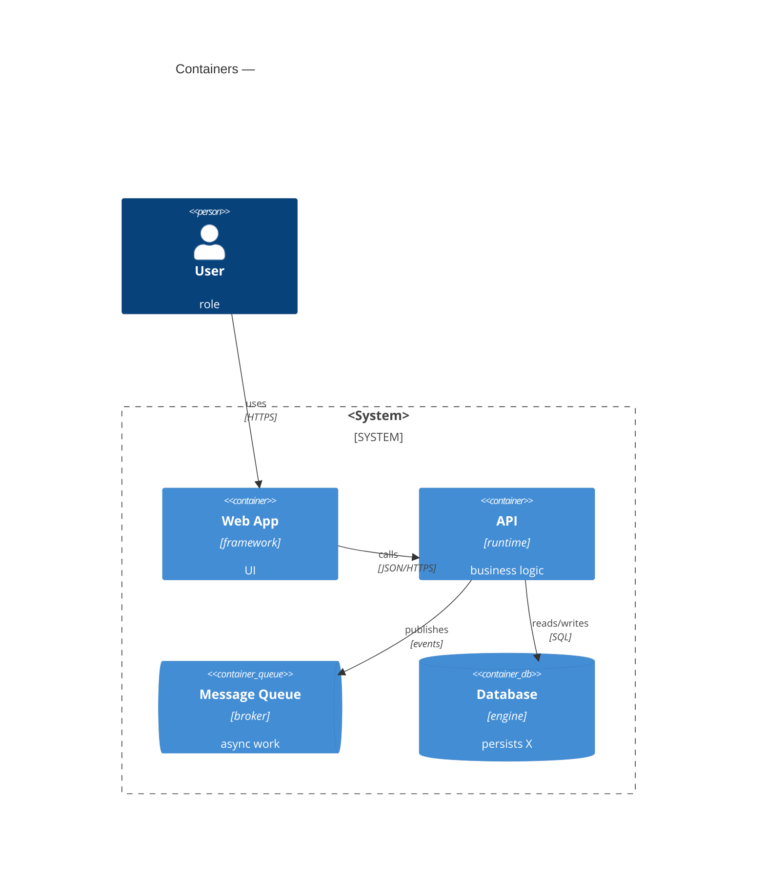

### C4 Component — the internals of one container

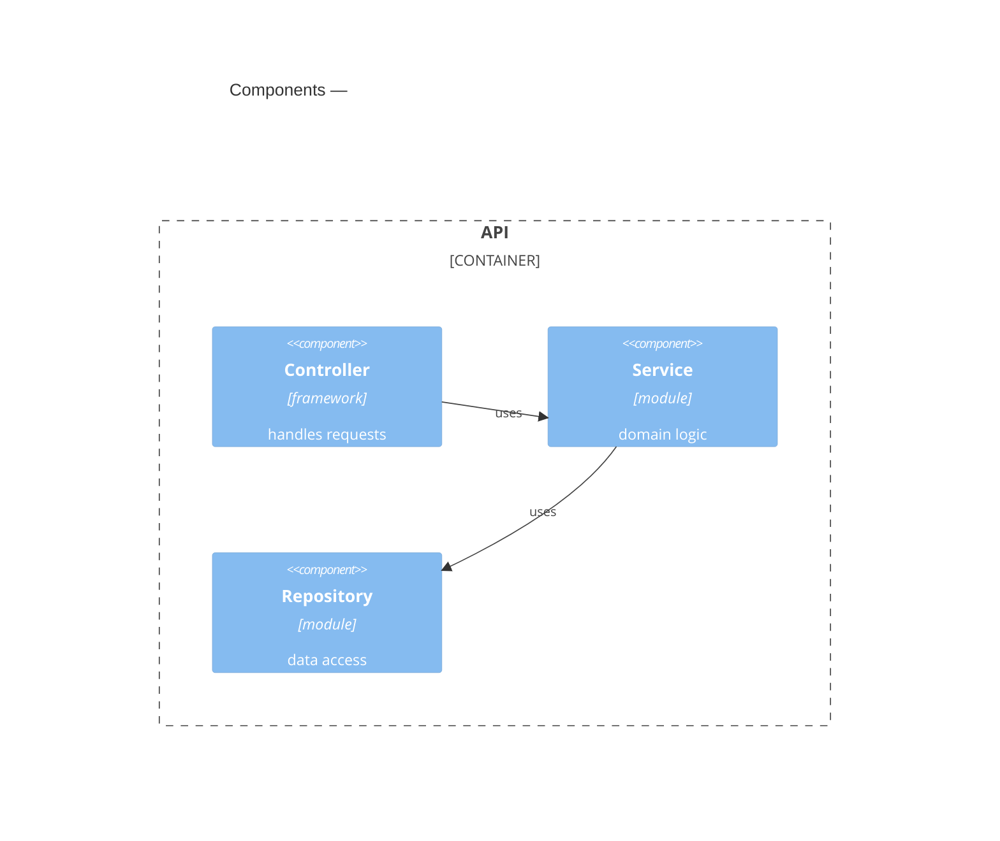

### C4 Dynamic — a runtime interaction across containers (numbered steps)

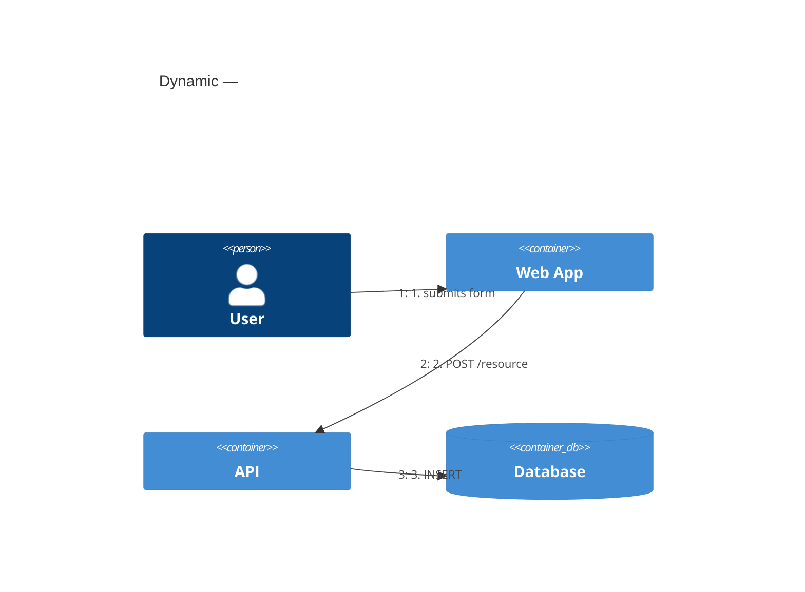

## UML family

Structural and behavioral views. Use selectively, where a C4 view does not
answer the question.

### Class — entities, attributes, methods, relations (structural)

Defines the vocabulary and responsibilities. Relations: inheritance,
association, composition, aggregation.

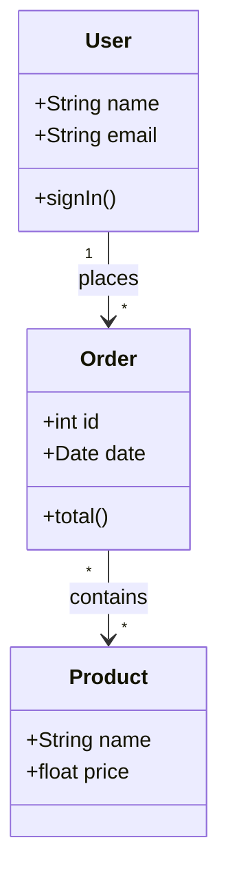

### Use case — actors and the functionality they reach (behavioral)

High-level scope agreement. The "what" from the user's perspective, never the
"how". Mermaid has no native use-case diagram; model actors and use cases as
nodes.

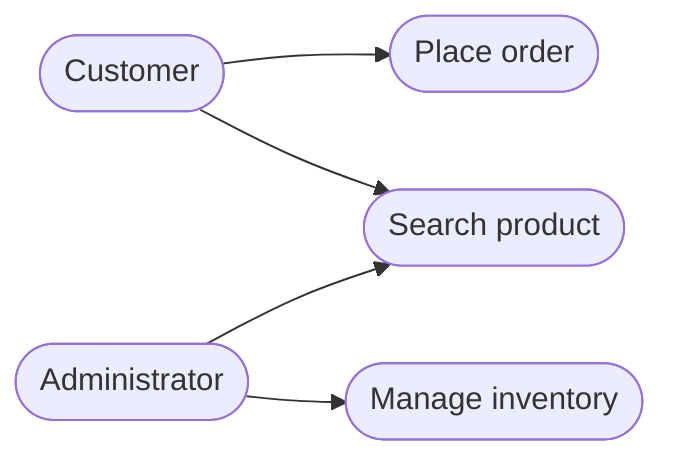

### Sequence — messages between participants over time (behavioral)

The temporal dimension of one scenario. Ideal for APIs, protocols, debugging a
concrete flow.

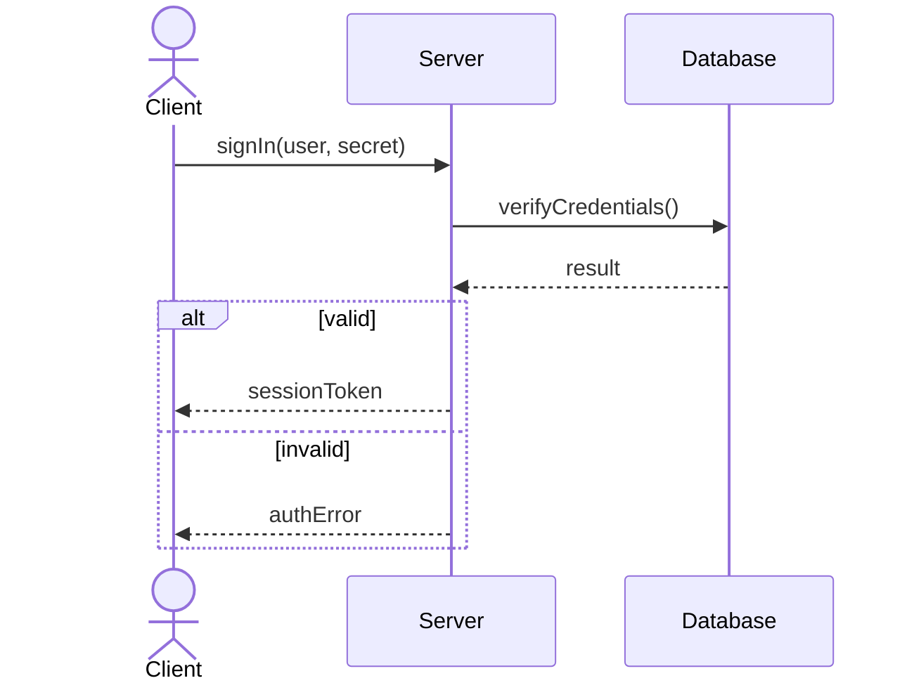

### Activity — control flow of a process, with decisions and parallelism

Process logic end to end. Surfaces bottlenecks and business rules.

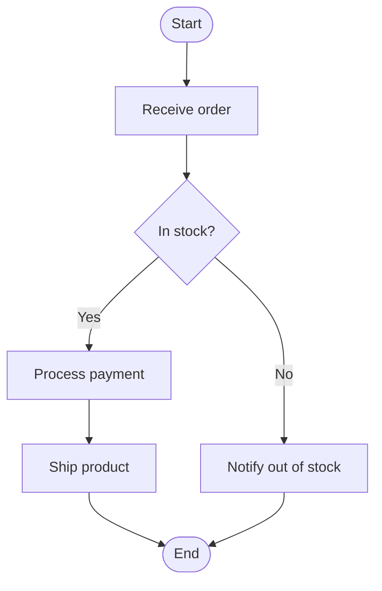

### State — the lifecycle of one entity and its transitions (behavioral)

Captures valid states and the events that move between them; prevents invalid
states. For event-driven logic and state machines.

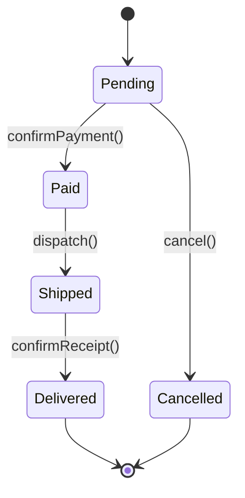

### Component — software components and their dependencies (structural)

A high-level structural view. At the system level prefer C4 Container, which
carries richer semantics; reach for this when a plain dependency sketch
suffices.

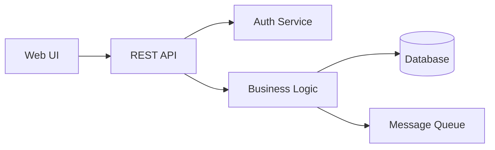

### User journey — phases, steps, and sentiment (experience)

Maps the experience over time with a sentiment score (1–5) per step. Descriptive
context, not behaviorally enforceable; pair it with testable quality criteria.

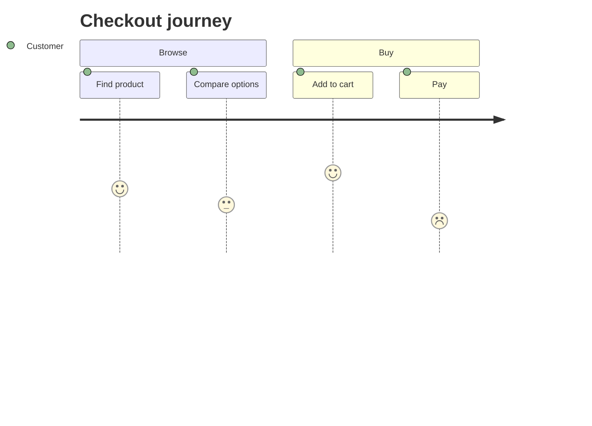
