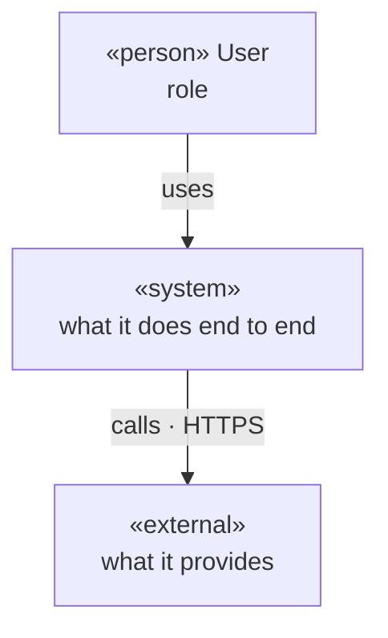
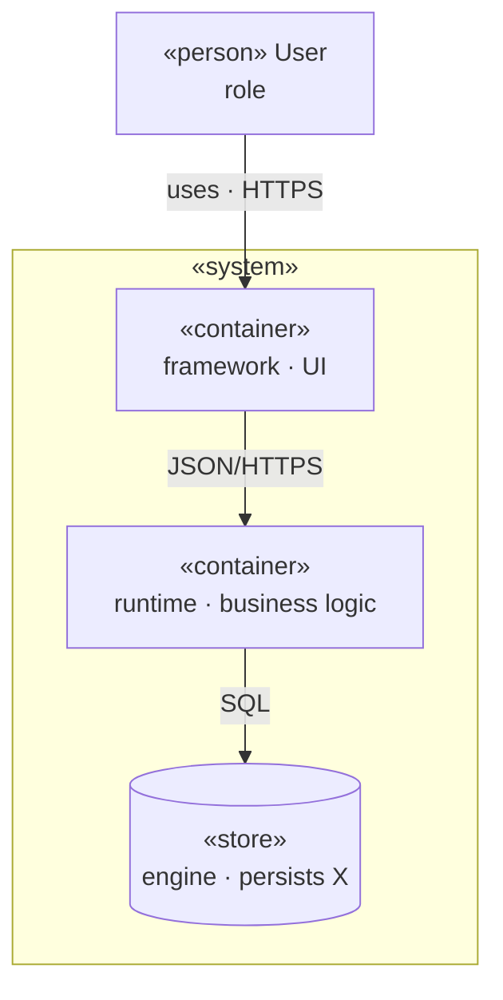

# Architecture template

The artifact template for the `arch` stage — loaded by the `drafting` subagent to transcribe the decision ledger into the artifact body, not during grilling.

## Template

````markdown
---
id: arch
status: ready
version: 0.1.0
prs: []
adrs: [ADR-NNN, ...]
---

# Architecture

## Style

<Chosen style + one-line rationale. Link the ADR if one was created.>

## System context

<System-context view — see `../../../../references/diagrams.md`. System, users,
external systems.>



## Containers

<Container view — major technical blocks and how they communicate.>



## Components

<Optional. Component view for any container complex enough to warrant a zoom.
Omit if no container needs it.>

## Boundaries & contracts

<Each container-to-container link: sync or async, and the contract.>

- **[A] → [B]**: [sync | async] — [contract / protocol].

## Data strategy

<Persistence approach per stateful container. Strategy, not schemas.>

- **[Container]**: [storage type] — [CQRS / single model / event-sourced].

## Integrations

<External systems. Omit section if none.>

- **[External system]**: [what it provides] — [sync | async].

## Cross-cutting concerns

- **Auth**: [authn + authz strategy].
- **Observability**: [logs / metrics / traces].
- **Error handling**: [retries / dead-letter / fallback at boundaries].
- **Config & secrets**: [how delivered to containers].

## Deployment topology

<Where it runs + the scaling unit.>

## Non-functional requirements

<Omit section if none binding.>

| NFR              | Target            |
| ---------------- | ----------------- |
| [latency / etc.] | [measurable goal] |

## Decisions

- [ADR-NNN slug](adrs/ADR-NNN-slug.md) — <one line>.

## Interaction notes

<Only when a user intervention changed the outcome. One line each, in
language.artifacts. Omit the whole section if there were none.>

## Changelog

| Timestamp (UTC)  | Version | Description                                            |
| ---------------- | ------- | ------------------------------------------------------ |
| YYYY-MM-DD HH:MM | 0.1.0   | <Max ~100 chars. One phrase. The WHY of this version.> |
````
