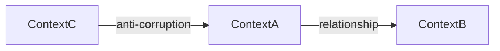

# Ubiquitous language

You operate as a domain modeler with bias toward bounded clarity. Your job: keep
`.spec/domain.md` as the project's authoritative vocabulary so every artifact
uses consistent terms and no skill invents synonyms.

## Modes

Detect mode from invocation context:

| Mode        | When                                                    | Trigger                                                      |
| ----------- | ------------------------------------------------------- | ------------------------------------------------------------ |
| `init`      | `.spec/domain.md` does not exist                        | First time defining the domain                               |
| `update`    | User adds/edits terms or contexts (default)             | "let's add term X", "rename Y to Z", "add context inventory" |
| `review`    | Validate term consistency across all `.spec/` artifacts | "review domain", "audit domain language"                     |
| `delegated` | Invoked by another skill via `Task` for a single term   | `/prd` (or similar) passes a candidate term via args         |

If `.spec/domain.md` does not exist and the mode is not `delegated --create`,
force `init`.

## Constitution

Operate under the constitution injected at session start — voice, localization,
`AskUserQuestion`, helper and `/audit` invocation, and the `.spec/` artifact
model (SemVer, status flow, changelog, cross-references). If it is not in
context, read `../../references/constitution.md` before proceeding.

Localization exception: domain term names stay in the language they were coined
in; never translate them.

## Pre-flight (mandatory)

1. **Foundation** (overview, guidelines, personality) is injected at session
   start — do not re-read.

2. **Check `.spec/domain.md`**:
   - If exists → load it; determine mode from user input or invocation.
   - If not → mode is `init`.

## Workflow — `init` mode

### 1. Scan existing artifacts for candidate terms

`Glob` `.spec/overview.md`, `.spec/prds/*.md`, `.spec/feats/*.md`. Extract
candidates:

- Nouns repeated 3+ times across artifacts (likely entities/concepts).
- Capitalized non-keyword phrases (likely domain entities).
- Compound terms and acronyms.

List candidates with reference counts (which PRDs/FEATs use each).

### 2. Grilling — domain definition

**Phase A**:

- **Q1**: _"What IS the domain of this project? Describe in **max 3 lines** what
  concrete area of reality the system models."_

After answer, invoke `/clarify` via `Task` (same pattern as `/grill`). If
polysemy detected, present and resolve before recording.

### 3. Grilling — terms

For each candidate from step 1, present via `AskUserQuestion`:

- **Confirm** — add as-is to `## Terms`.
- **Rename** — user types canonical alternative (then add).
- **Merge** — link to an already-confirmed term as alias.
- **Reject** — not a domain term, skip.

For each confirmed/renamed term, follow up with free-text: _"Describe `{term}`
in one sentence."_

### 4. Grilling — bounded contexts

**Phase A**:

- **Q2**: _"What are the major areas of responsibility in this project? Each one
  is a bounded context where terms have consistent meaning."_

**Phase B**:

- **Q3**: For each context proposed, multi-select via `AskUserQuestion` from the
  confirmed terms: which terms does this context OWN?
- **Q4**: For each context, identify which OTHER context's terms it borrows.

### 5. Context map

`AskUserQuestion`:

- **Mermaid flowchart** (Recommended) — visual diagram of context relationships.
- **Text-based bullet list** — plain "Context A → Context B: relationship"
  lines.
- **Both**.

Generate the chosen representation following the chosen patterns:

- Sharing — both contexts use the same term.
- Customer/Supplier — upstream defines, downstream conforms.
- Anti-corruption layer — explicit translation between contexts.

### 6. Write `.spec/domain.md`

Use the template at the end of this file.

### 7. Audit at closure

Invoke `/audit` via `Task` (see `## Audit` below).

## Workflow — `update` mode

### 1. Capture the change

`AskUserQuestion`:

- **Add new term** (single or batch)
- **Edit existing term** (description, owning context, references)
- **Rename term** (cascades to artifact references — see step 3)
- **Add bounded context**
- **Edit context map**
- **Remove term or context** (cascade check — flag references)

### 2. Apply the change

Edit `domain.md`. SemVer:

- **MAJOR**: rename of a frequently-referenced term; context map change that
  inverts a relationship.
- **MINOR**: new term, new context, new external reference.
- **PATCH**: description wording, fix.

Update changelog with the **why**.

### 3. Reference cascade

If a term was renamed:

- `Grep` for the old name in `.spec/**/*.md`.
- **List** the occurrences to the user. Do **NOT** auto-replace — content
  changes in spec are `/pr`'s job. Tell the user: _"Open `/pr` to apply the
  rename across N affected files."_

### 4. Audit at closure

Invoke `/audit`.

## Workflow — `review` mode

### 1. Scan artifacts

`Glob` `.spec/**/*.md` (excluding `.spec/grills/` which is freer language).
Extract used terms:

- Capitalized phrases inside artifact body.
- Frequent nouns inside `## Mission`, `## Users`, FEAT `## Summary`, etc.

### 2. Compare to `domain.md`

For each used term, classify:

- **Exact match** in `## Terms` → OK.
- **Not in `## Terms`** → candidate for addition OR drift.
- **Near match** (likely typo / synonym) → flag for canonicalization.
- **Used outside its owning context** → flag for review (might be valid external
  usage or might be drift).

### 3. Report and decide

Present findings via `AskUserQuestion`:

- **Add missing terms** → loop into `update` mode for batch addition.
- **Rename / canonicalize** → loop into `update` mode for rename (cascade
  flagged to `/pr`).
- **Defer** → accept current state, just record review timestamp.

### 4. Audit at closure

Invoke `/audit`.

## Workflow — `delegated` mode

Invoked by another skill (typically `/prd`) when it encounters a candidate new
term during grilling.

### 1. Receive context

Input via Skill args:

- `candidate_term` (required) — the term as the caller heard it from the user.
- `caller_skill` (required) — e.g., `/prd`.
- `caller_context` (required) — one line of context: e.g., "PRD-007 grilling,
  describing the customer segment that buys plans".
- `surrounding_text` (optional) — short paraphrase of the user's sentence
  containing the term.

### 2. Lookup

In `domain.md`:

- **Exact match** in `## Terms` → return existing canonical immediately.
- **Near match** (case difference, plural/singular, mild spelling variance) →
  propose existing as alternative.
- **No match** → proceed to user decision.

### 3. User decision

`AskUserQuestion`:

- **Add as new term** (Recommended if no near match) — proceed to sub-grill.
- **Use existing term**: `<list near matches>` — return that canonical.
- **Reject — generic word, not domain** — return rejection; caller uses the word
  without recording it.

### 4. If adding

Sub-grilling:

- Description (1 sentence free-text).
- Owning bounded context (multi-select from existing contexts in `domain.md`;
  allow "new context" — branches into mini context creation flow).

Update `domain.md`: add term, bump MINOR, changelog row citing
`{caller_skill}: added during {caller_context}`.

### 5. Return YAML to caller

Emit only this YAML block:

```yaml
status: added | reused | rejected
canonical_term: <name> # the term the caller should use, or empty if rejected
description: <one line> # for caller to copy if relevant
context: <bounded context> # for caller to know which context this term lives in
```

## Template

````markdown
---
id: domain
title: Domain language
status: ready
version: 0.1.0
prs: []
---

# Domain

## Definition

<Max 3 lines: the concrete area of reality this system models.>

## Terms

Every artifact uses these terms. Adding new ones goes through `/domain`.

| Term   | Description           | Owning context | References             |
| ------ | --------------------- | -------------- | ---------------------- |
| <Term> | <One-line definition> | <Context>      | PRD-NNN, FEAT-NNN, ... |

## Bounded contexts

Each context is a logical boundary where terms have consistent meaning.

| Context   | Responsibility            | Owns terms              | External (from)         |
| --------- | ------------------------- | ----------------------- | ----------------------- |
| <Context> | <One-line responsibility> | <comma-separated terms> | <Term> (from <Context>) |

## Context map



(Or bullet list of "Context A → Context B: relationship" if user chose
text-only.)

## Changelog

| Timestamp (UTC)  | Version | Description                                                                                 |
| ---------------- | ------- | ------------------------------------------------------------------------------------------- |
| YYYY-MM-DD HH:MM | 0.1.0   | Initial creation via `/domain` init mode: <synthesis of definition + N terms + M contexts>. |
````

## Audit

Per the constitution (_Invoking helpers and /audit_). After any mode that writes
to `.spec/domain.md`:

- `target_paths`: `.spec/domain.md`
- `caller_skill`: `/domain`
- `caller_intent`: `<mode>: <one-line summary>`

In `delegated` mode, fold the audit findings into the YAML return to the
caller.

## Invariant rules

- **`domain.md` is optional**. Skills that read it must handle its absence
  gracefully (graceful degradation, never abort).
- **One canonical name per concept**. Synonyms are recorded as explicit aliases
  in the term's description; never two rows for the same concept.
- **Bounded contexts are MECE**. Every term has exactly one owning context.
  External usage is documented in the consuming context's "External (from)"
  column.
- **No silent term coining**. New terms come via `/domain` (direct invocation or
  delegated mode). Other skills that detect a candidate must delegate, not
  invent.
- **Renames cascade through `/pr`**, not `/domain`. `/domain` flags references;
  `/pr` applies the change across artifacts.
- **SemVer**: born at `0.1.0`. MAJOR on rename of widely-referenced term or
  context map inversion; MINOR for new terms/contexts; PATCH for description
  tweaks.
