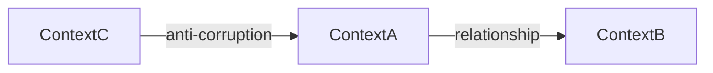

# Domain template

The artifact template for the `domain` stage — loaded by the `drafting` subagent to transcribe the decision ledger into the artifact body, not during grilling.

## Template

````markdown
---
id: domain
status: ready
version: 0.1.0
prs: []
---

# Domain

## Definition

<Max 3 lines: the concrete area of reality this system models.>

## Terms

Every artifact uses these terms. Adding new ones goes through `domain`.

| Term   | Description           | Owning context | References             |
| ------ | --------------------- | -------------- | ---------------------- |
| <Term> | <One-line definition> | <Context>      | PRD-NNN, FEAT-NNN, ... |

## Bounded contexts

Each context is a logical boundary where terms have consistent meaning.

| Context   | Responsibility            | Owns terms              | External (from)         |
| --------- | ------------------------- | ----------------------- | ----------------------- |
| <Context> | <One-line responsibility> | <comma-separated terms> | <Term> (from <Context>) |

## Context map



(Or bullet list of "Context A → Context B: relationship" if user chose
text-only.)

## Interaction notes

<Only when a user intervention changed the outcome. One line each, in
language.artifacts. Omit the whole section if there were none.>

## Changelog

| Timestamp (UTC)  | Version | Description                                                                                 |
| ---------------- | ------- | ------------------------------------------------------------------------------------------- |
| YYYY-MM-DD HH:MM | 0.1.0   | Initial creation via `domain` init mode: <synthesis of definition + N terms + M contexts>. |
````
