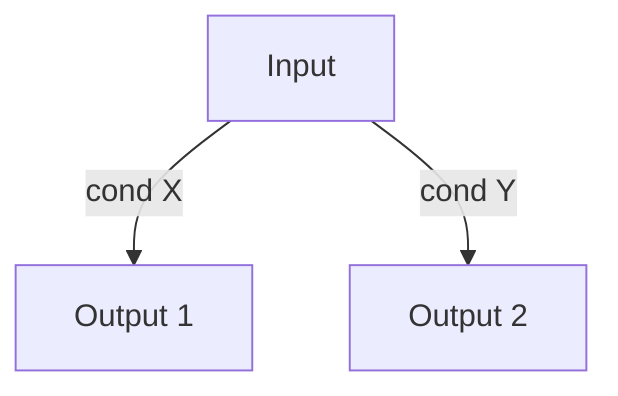
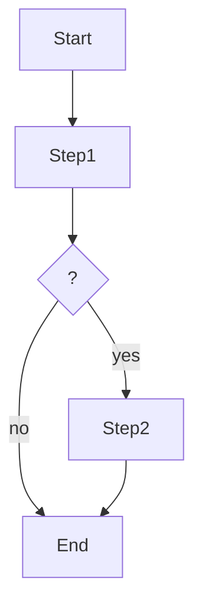
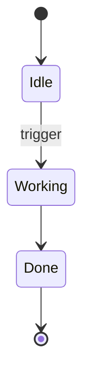
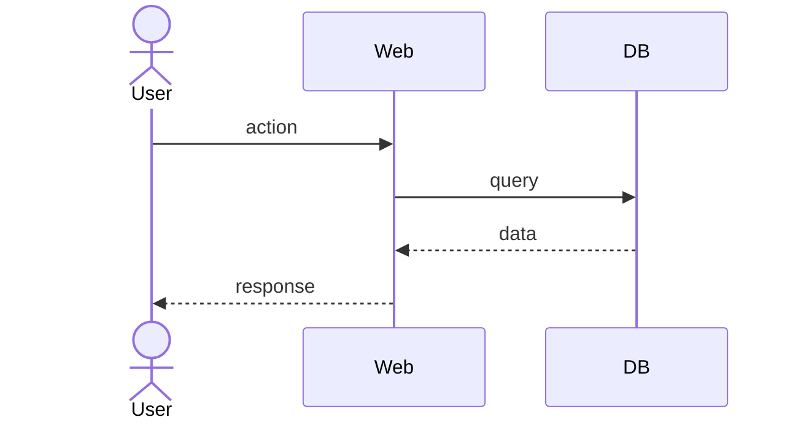

# FEAT template

The artifact template for the `feat` stage — loaded by the `drafting` subagent to transcribe the decision ledger into the artifact body, not during grilling.

## Template

````markdown
---
id: FEAT-NNN
status: draft
version: 0.1.0
prs: []
reviews: []
prd: PRD-NNN
adrs: [ADR-NNN, ...]
depends_on: [FEAT-NNN, ...]
---

# <Title>

## Summary

<2–3 sentences: what it does and what it leaves to the system when done.>

## Scope

**In**:

- <…>

**Out**:

- <…>

## Rules (decision tree)



## Logic (activity diagram)



## States (state diagram)



## Flows (sequence diagram)



## Acceptance criteria

- [ ] <Observable testable condition>
- [ ] <Observable testable condition>

## Dependencies

- [FEAT-NNN slug](FEAT-NNN-slug.md) — must be `done` before starting.
- [ADR-NNN slug](../adrs/ADR-NNN-slug.md)

## Implementation plan

_(Completed in `/code`)_

## Interaction notes

<Only when a user intervention changed the outcome. One line each, in
language.artifacts. Omit the whole section if there were none.>

## Changelog

| Timestamp (UTC)  | Version | Description                                                                       |
| ---------------- | ------- | --------------------------------------------------------------------------------- |
| YYYY-MM-DD HH:MM | 0.1.0   | Initial creation as part of PRD-NNN breakdown: <order and dependencies agreed>.   |
````

> Mermaid blocks follow `../../../../references/diagrams.md` — no theme or init block.
