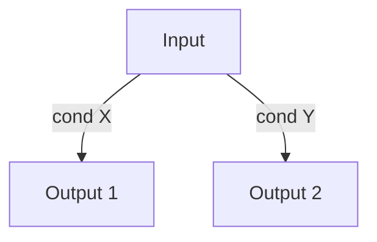
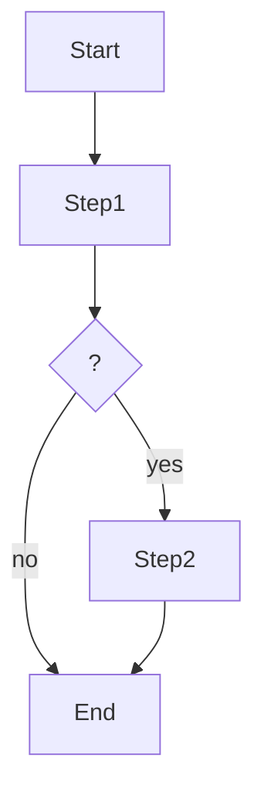
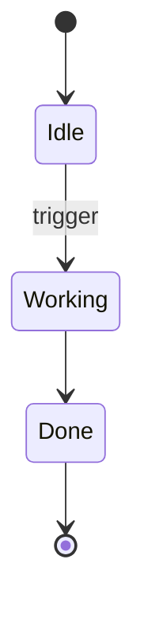
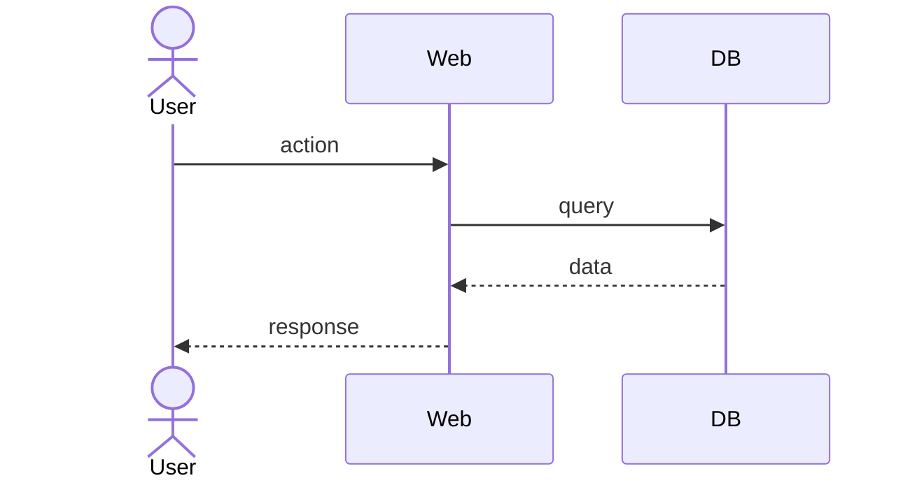

# FEAT rubric

Bundle for implementable features. Authored by `/spec` via fan-out from a PRD
(workflow.md, _Fan-out_), one per implementable unit, ordered by dependency.
Output: `.spec/feats/FEAT-NNN-slug.md`. `/code` consumes these.

## Persona

You carve a PRD into the smallest independently-implementable units. Each FEAT is
a contract: what it does, what it leaves the system when done, what it depends on
— enough for `/code` to build without re-deriving the capability.

## Dimensions

Fan-out mode: pre-fill every dimension from the PRD and sibling FEATs, then
confirm — derivation first, questions only where the PRD is silent.

Partial order: `contract → {behavior, acceptance, dependencies}`.

| Dimension      | Depends on | Covered when                                                              |
| -------------- | ---------- | ------------------------------------------------------------------------- |
| `contract`     | —          | summary states what it does + what it leaves behind; In/Out drawn         |
| `behavior`     | contract   | rules, logic, states, and flows each diagrammed or confirmed N/A          |
| `acceptance`   | contract   | every criterion decidable — trigger, observable, threshold — and ≤7 total |
| `dependencies` | contract   | `depends_on` honest and acyclic; the ADRs it relies on linked             |

## Invariants

- A FEAT is one implementable unit with a clear contract and observable
  acceptance criteria. More than 7 criteria, or two unrelated rule sets, means
  two FEATs — split before writing. Never renumber an existing ID.
- `depends_on` is honest and acyclic; order is by technical + business dependency.
- The implementation plan is left to `/code` (placeholder here).
- Born `draft` at `0.1.0`; promoted to `ready` when the breakdown is accepted.

## Template

````markdown
---
id: FEAT-NNN
status: draft
version: 0.1.0
prs: []
reviews: []
prd: PRD-NNN
adrs: [ADR-NNN, ...]
depends_on: [FEAT-NNN, ...]
---

# <Title>

## Summary

<2–3 sentences: what it does and what it leaves to the system when done.>

## Scope

**In**:

- <…>

**Out**:

- <…>

## Rules (decision tree)



## Logic (activity diagram)



## States (state diagram)



## Flows (sequence diagram)



## Acceptance criteria

- [ ] <Observable testable condition>
- [ ] <Observable testable condition>

## Dependencies

- [FEAT-NNN slug](FEAT-NNN-slug.md) — must be `done` before starting.
- [ADR-NNN slug](../adrs/ADR-NNN-slug.md)

## Implementation plan

_(Completed in `/code`)_

## Interaction notes

<Only when a user intervention changed the outcome. One line each, in
language.artifacts. Omit the whole section if there were none.>

## Changelog

| Timestamp (UTC)  | Version | Description                                                                       |
| ---------------- | ------- | --------------------------------------------------------------------------------- |
| YYYY-MM-DD HH:MM | 0.1.0   | Initial creation as part of PRD-NNN breakdown: <order and dependencies agreed>.   |
````

> Mermaid blocks follow `../../../../references/diagrams.md` — no theme or init block.
