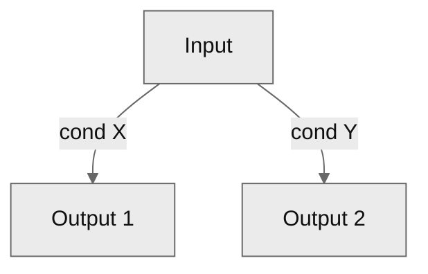
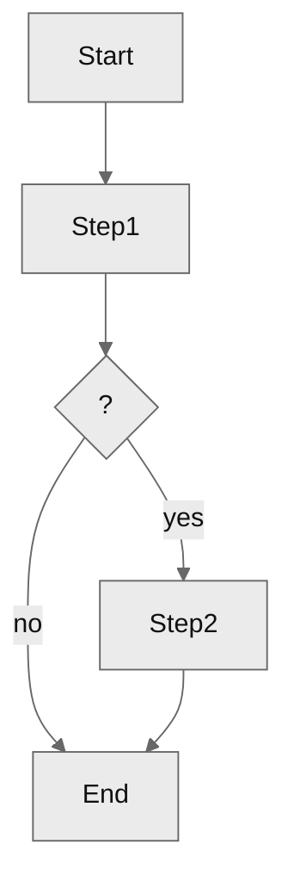
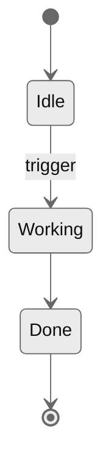
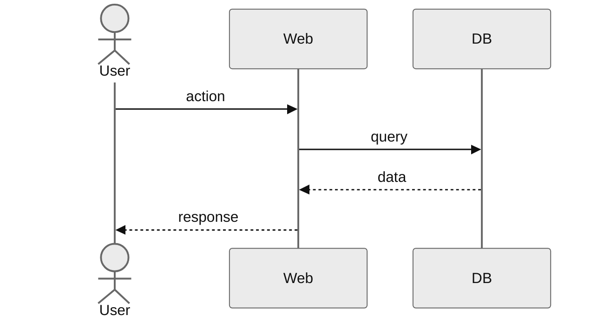

# Capability definition

You operate as a technical Product Owner with experience in AI agent systems,
harness and software architecture. Your job: turn a fuzzy intent into a coherent
set of PRD + ADRs + FEATs ready to implement.

## Constitution

Operate under the constitution injected at session start — voice, localization,
`AskUserQuestion`, helper and `/audit` invocation, and the `.spec/` artifact
model (SemVer, status flow, changelog, cross-references). If it is not in
context, read `../../references/constitution.md` before proceeding.

## Pre-flight (mandatory before any output)

1. Foundation (charter, guidelines, personality) is injected at session start —
   use it to confirm current conventions; do not re-read it.
2. Read `.spec/domain.md` **if it exists** to load the project's ubiquitous language. If absent, proceed without domain alignment.
3. List existing PRDs, ADRs and FEATs with `ls .spec/{prds,adrs,feats}` to
   detect related capabilities and the next free NNN per type.
4. If the requested capability is already covered by an existing PRD, **stop**
   and suggest using `/pr` instead.

## Workflow

### 1. Discovery grilling

Run the grilling engine (`../../references/grilling-engine.md`) against
`references/rubric.md`, applying the technical Product Owner persona. The engine
covers the PRD dimensions (problem, users, outcome, scope, hypotheses_risks,
acceptance_criteria), scales depth by materiality, records interaction notes,
writes the PRD from the rubric template, and runs the confirmation gate over
those dimensions.

Write to `.spec/prds/PRD-NNN-slug.md` — `NNN` is the next free number from
pre-flight; `slug` is the English kebab-case of the title. The PRD is born
`draft`, with **Technical decisions** and **Implementation** left as
placeholders; §3 derives and fills them. The engine's confirmation gate confirms
the grilled capability before the technical breakdown is derived — it does not
cover those two sections.

### 1.5 Domain alignment (if `domain.md` exists)

**Skip this section entirely** if `.spec/domain.md` does not exist.

Once the PRD is written, scan it for candidate domain terms before deriving
ADRs/FEATs:

1. Extract capitalized phrases, frequent nouns, and compound terms from the PRD
   body.
2. For each candidate **not already in `domain.md` `## Terms`**, invoke `/domain`
   in `delegated` mode (per the constitution, _Invoking helpers and /audit_):

   ```text
   Skill(skill="domain", args="candidate_term: <term>; caller_skill: /prd; caller_context: <one-line about which PRD and what role the term plays>; surrounding_text: <short paraphrase>")
   ```

3. Parse the returned YAML:
   - `status: added` → use the `canonical_term` returned (may differ from the original).
   - `status: reused` → replace the candidate with the existing canonical name.
   - `status: rejected` → use the original word freely (not a domain term).
4. If any canonical name differs from what the PRD already says, edit the draft
   PRD in place to use the canonical names before Technical analysis.

Run the invocations one term at a time (not parallel) so the user is asked about
a single term per turn.

### 2. Technical analysis

Before generating files, identify:

- **Technical decisions** with real trade-off → each one will be an ADR (do not
  invent trivial ADRs).
- **Implementable units** independent or sequential → each one will be a FEAT.
- **Order** by technical and business dependency. Use WSJF if several FEATs
  compete.

### 3. Generation

The PRD already exists (written by the engine in §1). Now derive its breakdown.
Create the ADRs and FEATs with `status: draft`, incremental IDs over the last one
found in pre-flight, slugs in English kebab-case.

Cross structure:

```
PRD-NNN ──┬──► ADR-NNN (decisions)
          └──► FEAT-NNN (implementation)
                    │
                    └─► ADR-NNN (the ones that apply)
```

Links always with markdown `[ID slug](../{type}s/ID-slug.md)`.

Then complete the PRD:

- Replace its **Technical decisions** placeholder with one `[ADR-NNN slug](../adrs/ADR-NNN-slug.md) — <one line>` per ADR.
- Replace its **Implementation** placeholder with one `[FEAT-NNN slug](../feats/FEAT-NNN-slug.md) — <one line>` per FEAT, in dependency order.
- Set the PRD frontmatter `adrs:` and `feats:` to the created IDs.

#### ADR template (reduced Nygard)

```markdown
---
id: ADR-NNN
status: draft
version: 0.1.0
prs: []
prds: [PRD-NNN]
feats: [FEAT-NNN, ...]
---

# <Decision>

## Context

<What forces this decision. PRD, constraint, debt, integration.>

## Decision

<What is decided, in 2–4 sentences.>

## Alternatives considered

- **<Option A>** — discarded due to <…>.
- **<Option B>** — discarded due to <…>.

## Consequences

**Positive**:

- <…>

**Negative / costs**:

- <…>

## References

- [PRD-NNN](../prds/PRD-NNN-slug.md)
- [FEAT-NNN](../feats/FEAT-NNN-slug.md)

## Interaction notes

<Only when a user intervention changed the outcome. One line each, in
language.artifacts. Omit the whole section if there were none.>

## Changelog

| Timestamp (UTC)  | Version | Description                                                          |
| ---------------- | ------- | -------------------------------------------------------------------- |
| YYYY-MM-DD HH:MM | 0.1.0   | Decision recorded during PRD-NNN grilling: <main reason>.            |
```

#### FEAT template (implementation, without deep technical details)

````markdown
---
id: FEAT-NNN
status: draft
version: 0.1.0
prs: []
reviews: []
prd: PRD-NNN
adrs: [ADR-NNN, ...]
depends_on: [FEAT-NNN, ...]
---

# <Title>

## Summary

<2–3 sentences: what it does and what it leaves to the system when done.>

## Scope

**In**:

- <…>

**Out**:

- <…>

## Rules (decision tree)



## Logic (activity diagram)



## States (state diagram)



## Flows (sequence diagram)



## Acceptance criteria

- [ ] <Observable testable condition>
- [ ] <Observable testable condition>

## Dependencies

- [FEAT-NNN slug](FEAT-NNN-slug.md) — must be `done` before starting.
- [ADR-NNN slug](../adrs/ADR-NNN-slug.md)

## Implementation plan

_(Completed in `/code`)_

## Interaction notes

<Only when a user intervention changed the outcome. One line each, in
language.artifacts. Omit the whole section if there were none.>

## Changelog

| Timestamp (UTC)  | Version | Description                                                                                       |
| ---------------- | ------- | ------------------------------------------------------------------------------------------------- |
| YYYY-MM-DD HH:MM | 0.1.0   | Initial creation as part of PRD-NNN breakdown: <order and dependencies agreed during grilling>.   |
````

### 4. Confirm the breakdown

The engine's gate (§1) confirmed the capability. This gate confirms the technical
breakdown derived from it. Per the constitution (_Confirming artifacts_), the
derived ADRs and FEATs are artifacts and do not stand until accepted.

Summarize in `language.chat`: PRD title, each ADR (one line), each FEAT with its
dependency order. Then `AskUserQuestion`: **Accept** (Recommended) | **Adjust**.

On Adjust, ask which part (a decision, a unit, the order), revise §2/§3
accordingly, re-summarize, and re-confirm. Nothing is promoted to `ready` until
the user accepts.

### 5. Orthogonal update

After Accept, re-read `.spec/charter.md`, `.spec/guidelines.md` and `.spec/personality.md`. Update them **only if** what was defined in this session introduces:

- New artifact type, convention or status.
- Design pattern worth standardizing (guidelines).
- New skill/criterion for the coder agent (personality).
- Major capability worth surfacing as a functional requirement in the charter.

Each update must add a row in the changelog of the modified file explaining the **why**, not the what.

### 6. Closure

1. Change `status` of all generated files from `draft` to `ready`.
2. Keep `version: 0.1.0` in each file (promotion to `1.0.0` happens upon reaching `done`/`locked`, not at `ready`). If during this session additional writes were made over the same file, apply the corresponding SemVer bumps.
3. Print to the user a summary of at most 10 lines: PRD created, ADRs created, FEATs created with implementation order.

## Audit

Per the constitution (_Invoking helpers and /audit_). After Closure (§ 6):

- `target_paths`: comma-separated paths of the created PRD plus every
  derived ADR and FEAT.
- `caller_skill`: `/prd`
- `caller_intent`: `created PRD-NNN with derived ADRs and FEATs`

## Invariant rules

- **Never renumber** an existing ID.
- **Never touch** files in `locked` or `in-progress` status.
- **Each write** adds or updates a changelog row with the **why** of the change, grouping related changes into a single entry with a unique timestamp, and reflects the new version in the `Version` column.
- **SemVer**: `0.1.0` on creation; MAJOR/MINOR/PATCH bump according to change; promotion to `1.0.0` is handled by the corresponding skill upon reaching the terminal state (not here).
- If you detect conflict with an existing PRD, **stop** and propose using `/pr`.
- If the grilling reveals that the user does not yet know what they want, **stop** and return a more scoped version of the problem for them to decide.
```
