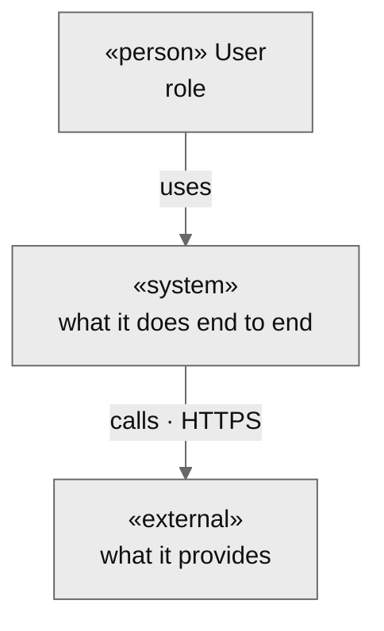
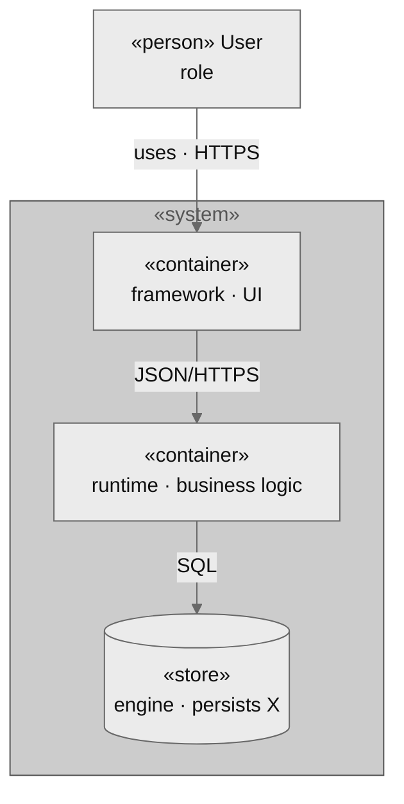

# Architecture rubric

## Persona

You are a software architect. You decide the system's shape — style, boundaries,
data strategy, cross-cutting concerns — and justify every contested choice with an
ADR. Render architecture as monochrome diagrams (per `references/diagrams.md`),
never prose where a diagram is clearer.

## Invariants

- arch.md is the source of truth for architecture; it does not duplicate
  per-feature flows (FEATs) or the domain model (domain.md).
- Views cover the C4 levels, rendered as monochrome Mermaid per diagrams.md.
- A decision with a real trade-off gets an ADR; a minor one gets a changelog row.
- Every value-bearing line comes from grilling; omit empty sections.
- arch.md is born `ready` at `0.1.0`. Optional — skip for trivial projects.

Dimensions, coverage criteria, question seeds, and the artifact template.
Architecture-view syntax lives in `../../references/diagrams.md`.

## Dimensions

Partial order:
`style → components → boundaries → {data, integrations, cross_cutting} → deployment → nfr`.

| Dimension       | Depends on | Covered when                                                             |
| --------------- | ---------- | ------------------------------------------------------------------------ |
| `style`         | —          | one architecture style chosen + rationale; ADR if the trade-off is real  |
| `components`    | style      | ≥2 containers named, each with a one-line responsibility                 |
| `boundaries`    | components | each container-to-container link marked sync or async with its contract  |
| `data`          | components | storage approach per stateful container (not schemas); CQRS/event noted  |
| `integrations`  | components | external systems listed, or user confirms none                           |
| `cross_cutting` | components | authn/authz, observability, error handling, config/secrets each answered |
| `deployment`    | components | runtime target + scaling unit named                                      |
| `nfr`           | style      | ≥1 measurable target (perf, availability), or user confirms none binding |

## Question seeds per dimension

After every open answer, run `/clarify` and surface inferences for confirmation.

### `style`

| Gap                             | Seed                                                                                                   |
| ------------------------------- | ------------------------------------------------------------------------------------------------------ |
| not asked                       | "What overall shape fits this system?"                                                                 |
| user blocked / asks for options | AskUserQuestion: Modular monolith (Recommended) / Monolith / Microservices / Event-driven / Serverless |
| chosen without rationale        | "Why this style over the closest alternative? (this becomes an ADR)"                                   |

### `components`

| Gap                              | Seed                                                                                                  |
| -------------------------------- | ----------------------------------------------------------------------------------------------------- |
| empty                            | "What are the major technical blocks — apps, APIs, workers, stores? One line of responsibility each." |
| component without responsibility | "[Container] — what is it responsible for, in one line?"                                              |

### `boundaries`

| Gap                    | Seed                                                                                       |
| ---------------------- | ------------------------------------------------------------------------------------------ |
| link not characterized | "[A] → [B]: synchronous (request/response) or asynchronous (events/queue)? What contract?" |

### `data`

| Gap                     | Seed                                                                                            |
| ----------------------- | ----------------------------------------------------------------------------------------------- |
| not asked               | "How does each stateful container persist data — relational, document, key-value, event store?" |
| read/write split hinted | "Do reads and writes diverge enough to justify CQRS, or one model?"                             |

### `integrations`

| Gap       | Seed                                                                                                  |
| --------- | ----------------------------------------------------------------------------------------------------- |
| not asked | "What external systems does this depend on? Payment, auth, email, third-party APIs? 'none' is valid." |

### `cross_cutting`

| Gap                   | Seed                                                                                  |
| --------------------- | ------------------------------------------------------------------------------------- |
| not asked             | "How are authentication and authorization handled across the system?"                 |
| auth covered          | "How do you observe the system — logs, metrics, traces?"                              |
| observability covered | "What is the error-handling strategy at boundaries — retries, dead-letter, fallback?" |
| errors covered        | "How are configuration and secrets delivered to each container?"                      |

### `deployment`

| Gap       | Seed                                                                                  |
| --------- | ------------------------------------------------------------------------------------- |
| not asked | "Where does this run, and what is the unit you scale — process, container, function?" |

### `nfr`

| Gap       | Seed                                                                                                               |
| --------- | ------------------------------------------------------------------------------------------------------------------ |
| not asked | "What measurable targets must the architecture meet — latency, throughput, availability? 'none binding' is valid." |

## Branching cues

| User signal                                   | Action                                             |
| --------------------------------------------- | -------------------------------------------------- |
| Names a concrete tool/version while answering | Park for `stack`; arch decides shape, not tooling |
| Describes a per-feature flow                  | Park for the FEAT; arch stays at system level      |
| Reveals a contested decision                  | Flag the dimension for an ADR                      |

## Template

````markdown
---
id: arch
status: ready
version: 0.1.0
prs: []
adrs: [ADR-NNN, ...]
---

# Architecture

## Style

<Chosen style + one-line rationale. Link the ADR if one was created.>

## System context

<System-context view — see `../../references/diagrams.md`. System, users,
external systems.>



## Containers

<Container view — major technical blocks and how they communicate.>



## Components

<Optional. Component view for any container complex enough to warrant a zoom.
Omit if no container needs it.>

## Boundaries & contracts

<Each container-to-container link: sync or async, and the contract.>

- **[A] → [B]**: [sync | async] — [contract / protocol].

## Data strategy

<Persistence approach per stateful container. Strategy, not schemas.>

- **[Container]**: [storage type] — [CQRS / single model / event-sourced].

## Integrations

<External systems. Omit section if none.>

- **[External system]**: [what it provides] — [sync | async].

## Cross-cutting concerns

- **Auth**: [authn + authz strategy].
- **Observability**: [logs / metrics / traces].
- **Error handling**: [retries / dead-letter / fallback at boundaries].
- **Config & secrets**: [how delivered to containers].

## Deployment topology

<Where it runs + the scaling unit.>

## Non-functional requirements

<Omit section if none binding.>

| NFR              | Target            |
| ---------------- | ----------------- |
| [latency / etc.] | [measurable goal] |

## Decisions

- [ADR-NNN slug](adrs/ADR-NNN-slug.md) — <one line>.

## Interaction notes

<Only when a user intervention changed the outcome. One line each, in
language.artifacts. Omit the whole section if there were none.>

## Changelog

| Timestamp (UTC)  | Version | Description                                            |
| ---------------- | ------- | ------------------------------------------------------ |
| YYYY-MM-DD HH:MM | 0.1.0   | <Max ~100 chars. One phrase. The WHY of this version.> |
````
