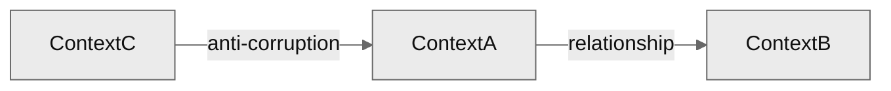

# Domain rubric

## Persona

You operate as a domain modeler with bias toward bounded clarity. Keep `domain.md`
the project's authoritative vocabulary so every artifact uses consistent terms and
no skill invents synonyms. (Term triage and delegated lookup: see `workflow.md` →
_Procedural orchestration → Domain_.)

## Invariants

- domain.md is optional; readers degrade gracefully when absent.
- One canonical name per concept; synonyms are explicit aliases, never a second
  row.
- Bounded contexts are MECE; every term has exactly one owning context.
- No silent term coining; renames cascade via the change flow, not here.
- Term names keep the language they were coined in; never translate them.

Dimensions, coverage criteria, question seeds, branching cues, and the artifact
template for `domain` init. Methodology lives in the grilling engine; this
rubric only supplies content. The `terms` dimension carries a specialized
procedure (candidate triage), not open grilling.

## Dimensions

Partial order: `definition → terms → bounded_contexts → context_map`.

| Dimension          | Depends on       | Covered when                                                       |
| ------------------ | ---------------- | ------------------------------------------------------------------ |
| `definition`       | —                | the modeled area of reality stated in ≤3 lines                     |
| `terms`            | definition       | every scanned candidate is confirmed, renamed, merged, or rejected |
| `bounded_contexts` | terms            | each context names its responsibility and the terms it owns        |
| `context_map`      | bounded_contexts | relationships between contexts rendered, or confirmed N/A          |

## Question seeds per dimension

### `definition`

| Gap       | Seed                                                                |
| --------- | ------------------------------------------------------------------- |
| not asked | "What IS the domain here? In ≤3 lines, the concrete area of reality the system models." |

### `terms` (specialized procedure)

Pre-fill from the candidate scan (see the skill's pre-flight). For **each
candidate**, `AskUserQuestion`: **Confirm** (add as-is) · **Rename** (canonical
alternative) · **Merge** (alias of a confirmed term) · **Reject** (not a domain
term). For each confirmed/renamed term, follow up: "Describe `<term>` in one
sentence."

| Gap                | Seed                                                                |
| ------------------ | ------------------------------------------------------------------- |
| candidate untriaged| "`<term>` appears in <refs>. Confirm, rename, merge, or reject?"     |
| confirmed, no desc | "Describe `<term>` in one sentence."                                |

### `bounded_contexts`

| Gap       | Seed                                                                |
| --------- | ------------------------------------------------------------------- |
| not asked | "What are the major areas of responsibility? Each is a context where terms hold one consistent meaning." |
| ownership | "Which confirmed terms does `<context>` own? Which does it borrow, and from where?" |

### `context_map`

| Gap       | Seed                                                                |
| --------- | ------------------------------------------------------------------- |
| not asked | "How do the contexts relate — sharing, customer/supplier, or anti-corruption? Render as a Mermaid flowchart, a bullet list, or both." |

## Branching cues

| User signal                                  | Action                                          |
| -------------------------------------------- | ----------------------------------------------- |
| Proposes a term that overlaps a confirmed one| Offer Merge before adding a duplicate           |
| Describes a per-feature rule, not a term     | Park for the FEAT; domain stays at term level   |
| Names a stack/tooling concept                | Park for `stack`; not a domain term            |

## Template

````markdown
---
id: domain
status: ready
version: 0.1.0
prs: []
---

# Domain

## Definition

<Max 3 lines: the concrete area of reality this system models.>

## Terms

Every artifact uses these terms. Adding new ones goes through `domain`.

| Term   | Description           | Owning context | References             |
| ------ | --------------------- | -------------- | ---------------------- |
| <Term> | <One-line definition> | <Context>      | PRD-NNN, FEAT-NNN, ... |

## Bounded contexts

Each context is a logical boundary where terms have consistent meaning.

| Context   | Responsibility            | Owns terms              | External (from)         |
| --------- | ------------------------- | ----------------------- | ----------------------- |
| <Context> | <One-line responsibility> | <comma-separated terms> | <Term> (from <Context>) |

## Context map



(Or bullet list of "Context A → Context B: relationship" if user chose
text-only.)

## Interaction notes

<Only when a user intervention changed the outcome. One line each, in
language.artifacts. Omit the whole section if there were none.>

## Changelog

| Timestamp (UTC)  | Version | Description                                                                                 |
| ---------------- | ------- | ------------------------------------------------------------------------------------------- |
| YYYY-MM-DD HH:MM | 0.1.0   | Initial creation via `domain` init mode: <synthesis of definition + N terms + M contexts>. |
````
