# Experience rubric

Dimensions, coverage criteria, question seeds, and the artifact template.
Methodology and pattern detail live in `patterns.md`; diagram syntax in
`../../references/diagrams.md`.

## Dimensions

Partial order: `surfaces → principles → mental_model → interactions → qualities →
{agent_layer, ui_layer} → flows → content_voice`.

| Dimension       | Depends on        | Covered when                                                                  |
| --------------- | ----------------- | ----------------------------------------------------------------------------- |
| `surfaces`      | —                 | ≥1 surface chosen, or user confirms headless (then skip the skill)            |
| `principles`    | surfaces          | 3–5 surface-agnostic experience principles (commitments, not aesthetics)      |
| `mental_model`  | —                 | the objects/states the user manipulates named (referencing domain if present) |
| `interactions`  | mental_model      | each key interaction has intent → action → response → feedback; stateful ones carry a statechart |
| `qualities`     | interactions      | ≥3 qualities as TRIGGER → OBSERVABLE → THRESHOLD; responsiveness + accessibility addressed |
| `agent_layer`   | surfaces=`agent`  | persona, conversation model, transparency, trust, control, latency, errors each answered |
| `ui_layer`      | surfaces visual   | IA/navigation, components, tokens, states, responsive each answered           |
| `flows`         | interactions      | ≥1 system-level flow/journey rendered in Mermaid                              |
| `content_voice` | surfaces          | voice/tone + message-catalog approach, or confirmed N/A                       |

## Question seeds per dimension

After every open answer, run `/clarify` and surface inferences for confirmation.

### `surfaces`

| Gap                              | Seed                                                                                |
| -------------------------------- | ----------------------------------------------------------------------------------- |
| not asked                        | "Through what surfaces do users experience this — web/mobile GUI, CLI, terminal UI, an agent/chat, voice? Pick all that apply." |
| no user-facing surface           | "This looks headless (library/service). Skip the experience doc?"                   |

### `principles`

| Gap                              | Seed                                                                                |
| -------------------------------- | ----------------------------------------------------------------------------------- |
| empty                            | "What must using this always feel like? 3–5 commitments (e.g. forgiving, instant, no surprises) — not colors." |
| answers are aesthetics           | "Reframe as an experience commitment, not a look. Not 'modern' but e.g. 'every action is reversible'." |

### `mental_model`

| Gap                              | Seed                                                                                |
| -------------------------------- | ----------------------------------------------------------------------------------- |
| not asked                        | "What objects does the user think they are manipulating, and what states do those move through?" |
| domain exists                    | "Use the domain terms — which entities does the user act on directly?"              |

### `interactions`

| Gap                              | Seed                                                                                |
| -------------------------------- | ----------------------------------------------------------------------------------- |
| empty                            | "What are the few interactions that define the product? For each: what does the user intend, what do they do, what does the system do back, and how does it signal it?" |
| action named as a widget         | "Describe the action by intent (input / select / trigger / confirm / navigate), not by a button or screen." |
| stateful interaction             | "This has states — sketch the statechart: states, events, transitions."             |
| feedback missing                 | "What does the system show, and within what time budget?"                           |

### `qualities`

| Gap                              | Seed                                                                                |
| -------------------------------- | ----------------------------------------------------------------------------------- |
| quality stated vaguely           | "Rewrite as TRIGGER → OBSERVABLE → THRESHOLD. 'Responsive' → 'any op >1s shows progress; first feedback ≤100ms'." |
| responsiveness missing           | "What are the latency budgets? (ack ≤100ms, flow ≤1s, attention ≤10s.)"             |
| accessibility missing            | "Accessibility targets? (WCAG contrast 4.5:1 / 3:1; focus 3:1; target 24×24.)"      |

### `agent_layer` (only if `agent` in surfaces)

| Gap                              | Seed                                                                                |
| -------------------------------- | ----------------------------------------------------------------------------------- |
| persona missing                  | "What is the agent's persona and voice? How is AI-generated content marked?"        |
| capability framing missing       | "How does the agent state what it can and cannot do, up front?"                     |
| conversation model missing       | "Turn-taking, grounding, and repair: when does it confirm, ask, or act?"            |
| transparency missing             | "How does it show its sources/reasoning — citations, stream-of-thought?"            |
| trust missing                    | "How do you prevent overtrust — disclaimers, confidence, disclosure?"               |
| control missing                  | "Undo, pause mid-stream, and approval before irreversible actions — what's the rule?" |
| latency missing                  | "What do streaming, partial results, and 'thinking' look like?"                     |
| errors missing                   | "How are hallucinations and 'no answer' handled? How does it disambiguate?"         |
| renders UI                       | "If the agent renders UI, what is the permitted component catalog?"                 |

### `ui_layer` (only if a visual surface in surfaces)

| Gap                              | Seed                                                                                |
| -------------------------------- | ----------------------------------------------------------------------------------- |
| ia missing                       | "What is the navigation model and the map of key screens/views?"                    |
| components missing               | "What design-system primitives are in use?"                                         |
| tokens missing                   | "Color, type, spacing, motion scales? (DTCG `$type`/`$value`, inline or `.spec/ux.tokens.json`.)" |
| states missing                   | "Loading, empty, and error patterns?"                                               |
| responsive missing               | "Breakpoints (GUI) or layout rules (TUI)?"                                          |

### `flows`

| Gap                              | Seed                                                                                |
| -------------------------------- | ----------------------------------------------------------------------------------- |
| not asked                        | "What is the main end-to-end journey? Render it as a Mermaid journey or flowchart (per-feature flows live in FEATs)." |

### `content_voice`

| Gap                              | Seed                                                                                |
| -------------------------------- | ----------------------------------------------------------------------------------- |
| not asked                        | "Voice and tone rules for system text? Where do user-facing strings live (message catalog)?" |

## Branching cues

| User signal                                   | Action                                                       |
| --------------------------------------------- | ------------------------------------------------------------ |
| Names a concrete framework/tool               | Park for `/stack`; ux decides experience, not tooling        |
| Describes a per-feature flow in detail        | Park for the FEAT; ux stays at system level                  |
| Reveals a contested experience decision       | Flag the dimension for an ADR                                |
| Names a domain entity                         | Reference `/domain`; do not redefine it here                 |

## Template

````markdown
---
id: ux
status: ready
version: 0.1.0
prs: []
adrs: []
surfaces: [<gui | tui | cli | agent | voice>, ...]
---

# Experience

## Principles

<3–5 surface-agnostic experience commitments.>

- [Principle].

## Mental model

<Objects and states the user manipulates. Reference domain terms; do not redefine them.>

## Interactions

<Per key interaction, the loop. Stateful interactions carry a statechart.>

### [Interaction]

```mermaid
%%{init: {'theme':'base','themeVariables':{'primaryColor':'#ebebeb','primaryBorderColor':'#686868','primaryTextColor':'#101010','lineColor':'#686868','secondaryColor':'#cccccc','tertiaryColor':'#a9a9a9','clusterBkg':'#cccccc','clusterBorder':'#525252','edgeLabelBackground':'#ebebeb'}}}%%
stateDiagram-v2
  [*] --> Idle
```

- **Intent**: <user goal>.
- **Action**: [input | select | trigger | confirm | navigate] — <parameters>.
- **Response**: <system state transition>.
- **Feedback**: <signal> within <time budget>.



## Experience qualities

<Each row is verifiable by /code and /rev.>

| Quality        | Trigger              | Observable            | Threshold                       |
| -------------- | -------------------- | --------------------- | ------------------------------- |
| Responsiveness | any operation        | first feedback        | ≤100 ms; progress if >1 s       |
| Accessibility  | themed fg/bg pair    | contrast ratio        | ≥4.5:1 (≥3:1 large / non-text)  |
| [Quality]      | [when]               | [what to observe]     | [measurable limit]              |

## Agent layer

<Only if `surfaces` includes `agent`. Omit otherwise.>

- **Persona & voice**: <persona; how AI-generated content is marked>.
- **Capability framing**: <what it can/can't do, stated up front>.
- **Conversation model**: <turn-taking, grounding, repair>.
- **Transparency**: <citation/reasoning display rules>.
- **Trust**: <overtrust mitigation, disclosure>.
- **Control**: <undo, pause, checkpoints before irreversible actions, escalation>.
- **Latency & streaming**: <ack, partial results, "thinking" state>.
- **Errors**: <hallucination handling, disambiguation>.
- **Generative UI**: <permitted component catalog, if the agent renders UI>.

## UI layer

<Only if `surfaces` includes a visual surface. Omit otherwise.>

- **Information architecture**: <navigation model, key-screen map>.
- **Components**: <design-system primitives in use>.
- **Design tokens**: DTCG `$type`/`$value` — inline below or `.spec/ux.tokens.json`.
- **Interaction states**: <loading / empty / error>.
- **Responsive / layout**: <breakpoints or layout rules>.

## Flows

<System-level journeys/flows in Mermaid (journey | flowchart | stateDiagram).
Per-feature flows live in FEATs.>

## Content & voice

<Voice & tone rules + message-catalog approach (ICU keys). Omit if N/A.>

## Interaction notes

<Only when a user intervention changed the outcome. One line each, in
language.artifacts. Omit the whole section if there were none.>

## Changelog

| Timestamp (UTC)  | Version | Description                                                |
| ---------------- | ------- | ---------------------------------------------------------- |
| YYYY-MM-DD HH:MM | 0.1.0   | <Max ~100 chars. One phrase. The WHY of this version.>     |
````
