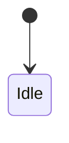

# UX template

The artifact template for the `ux` stage — loaded by the `drafting` subagent to transcribe the decision ledger into the artifact body, not during grilling.

## Template

````markdown
---
id: ux
status: ready
version: 0.1.0
prs: []
adrs: []
surfaces: [<gui | tui | cli | agent | voice>, ...]
---

# Experience

## Principles

<3–5 surface-agnostic experience commitments.>

- [Principle].

## Mental model

<Objects and states the user manipulates. Reference domain terms; do not redefine them.>

## Interactions

<Per key interaction, the loop. Stateful interactions carry a statechart.>

### [Interaction]

- **Intent**: <user goal>.
- **Action**: [input | select | trigger | confirm | navigate] — <parameters>.
- **Response**: <system state transition>.
- **Feedback**: <signal> within <time budget>.



## Experience qualities

<Each row is verifiable by /code and /rev.>

| Quality        | Trigger              | Observable            | Threshold                       |
| -------------- | -------------------- | --------------------- | ------------------------------- |
| Responsiveness | any operation        | first feedback        | ≤100 ms; progress if >1 s       |
| Accessibility  | themed fg/bg pair    | contrast ratio        | ≥4.5:1 (≥3:1 large / non-text)  |
| [Quality]      | [when]               | [what to observe]     | [measurable limit]              |

## Agent layer

<Only if `surfaces` includes `agent`. Omit otherwise.>

- **Persona & voice**: <persona; how AI-generated content is marked>.
- **Capability framing**: <what it can/can't do, stated up front>.
- **Conversation model**: <turn-taking, grounding, repair>.
- **Transparency**: <citation/reasoning display rules>.
- **Trust**: <overtrust mitigation, disclosure>.
- **Control**: <undo, pause, checkpoints before irreversible actions, escalation>.
- **Latency & streaming**: <ack, partial results, "thinking" state>.
- **Errors**: <hallucination handling, disambiguation>.
- **Generative UI**: <permitted component catalog, if the agent renders UI>.

## UI layer

<Only if `surfaces` includes a visual surface. Omit otherwise.>

- **Information architecture**: <navigation model, key-screen map>.
- **Components**: <design-system primitives in use>.
- **Design tokens**: DTCG `$type`/`$value` — inline below or `.spec/ux.tokens.json`.
- **Interaction states**: <loading / empty / error>.
- **Responsive / layout**: <breakpoints or layout rules>.

## Flows

<System-level journeys/flows in Mermaid (journey | flowchart | stateDiagram).
Per-feature flows live in FEATs.>

## Content & voice

<Voice & tone rules + message-catalog approach (ICU keys). Omit if N/A.>

## Interaction notes

<Only when a user intervention changed the outcome. One line each, in
language.artifacts. Omit the whole section if there were none.>

## Changelog

| Timestamp (UTC)  | Version | Description                                                |
| ---------------- | ------- | ---------------------------------------------------------- |
| YYYY-MM-DD HH:MM | 0.1.0   | <Max ~100 chars. One phrase. The WHY of this version.>     |
````
